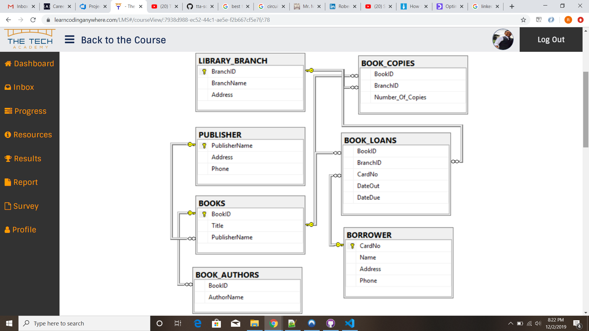

# TTA SQL Project

## Library Management System
Created a library management database. (SQL Server)

#### Project Requirements
USING MS SQL SERVER 2014 EXPRESS, CREATE A DATABASE AND SCHEMA AS DEPICTED IN THE FOLLOWING DIAGRAM:

[Click here to see the code.](https://github.com/rbmanez/TTA-SQL-Projects/tree/master/SQLLibraryManagementSystem)

INSTRUCTIONS - YOU MAY CHOOSE YOUR OWN DATA TO POPULATE YOUR TABLES AS LONG AS YOUR DATABASE ENSURES THAT THE FOLLOWING CONDITIONS ARE TRUE:
- There is a book called 'The Lost Tribe' found in the 'Sharpstown' branch.
- There is a library branch called 'Sharpstown' and one called 'Central'.
- There are at least 20 books in the BOOK table.
- There are at least 10 authors in the BOOK_AUTHORS table.
- Each library branch has at least 10 book titles, and at least two copies of each of those titles.
- There are at least 8 borrowers in the BORROWER table, and at least 2 of those borrowers have more than 5 books loaned to them.
- There are at least 4 branches in the LIBRARY_BRANCH table.
- There are at least 50 loans in the BOOK_LOANS table.
- There must be at least two books written by 'Stephen King' located at the 'Central' branch.

INSTRUCTIONS - CREATE STORED PROCEDURES THAT WILL QUERY FOR EACH OF THE FOLLOWING QUESTIONS:
1. How many copies of the book titled "The Lost Tribe" are owned by the library branch whose name is "Sharpstown"?
2. How many copies of the book titled "The Lost Tribe" are owned by each library branch?
3. Retrieve the names of all borrowers who do not have any books checked out.
4. For each book that is loaned out from the "Sharpstown" branch and whose DueDate is today, retrieve the book title, the borrower's name, and the borrower's address.
5. For each library branch, retrieve the branch name and the total number of books loaned out from that branch.
6. Retrieve the names, addresses, and the number of books checked out for all borrowers who have more than five books checked out.
7. For each book authored (or co-authored) by "Stephen King", retrieve the title and the number of copies owned by the library branch whose name is "Central".
